# PCA Builder & Visualization

Interactive MATLAB tool for learning Principal Component Analysis through hands-on exploration.

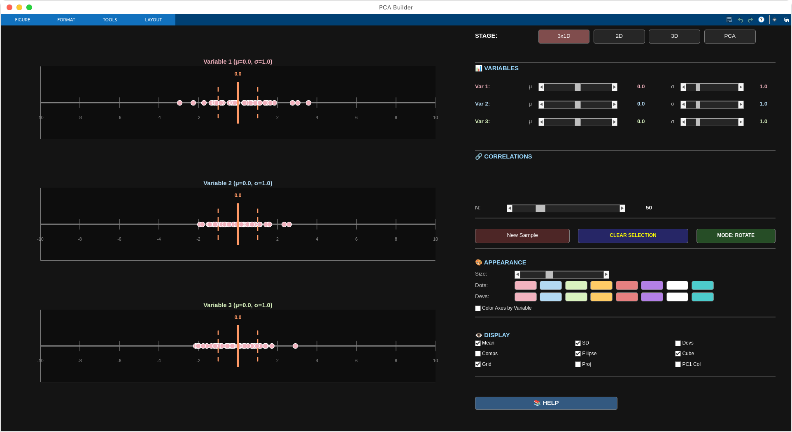

## Quick Access

**One-click launch in MATLAB Online:**  
[](https://matlab.mathworks.com/open/fileexchange/v1?id=182686)

**Alternative access:**
- [MATLAB File Exchange](https://uk.mathworks.com/matlabcentral/fileexchange/182686-pca-visualization-tool) - Download or rate
- [MATLAB Drive folder](https://drive.mathworks.com/sharing/a0c10730-3174-49c7-ae6e-f63b8f4355fa) - View files

*Requires free MathWorks account*
For individuals who have never used mahtlab before:
ONCE you are in mahtlab online (or runned locally), in the COMMAND TAB, type 'pca_builder' and it will open the vizualisation.
---

## What is this?

PCA is typically taught with formulas and static diagrams. This tool lets you manipulate parameters and immediately see how correlations affect data structure, how principal components emerge, and why they capture variance in specific directions.

Built for students learning multivariate statistics, educators teaching PCA, or anyone who wants to develop geometric intuition for how PCA works.

## Features

- Interactive control over means, standard deviations, and correlations
- Multiple visualization stages (1D, 2D, 3D, PCA)
- Click-through animations showing geometric decompositions
- Visual projections onto principal component axes
- Built-in educational reference with statistical formulas
- Preset scenarios demonstrating key concepts

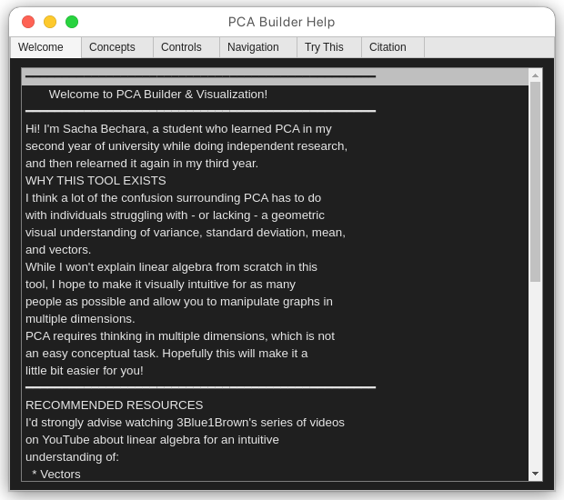

---

## Installation & Usage

### Option 1: One-Click (Recommended)

Click the "Open in MATLAB Online" badge above - it will launch directly in your browser.

### Option 2: Manual Installation

**If you have MATLAB:**

Download `pca_builder.m` and run it:
```matlab
pca_builder
```

**If you don't have MATLAB:**

1. Create free account at [matlab.mathworks.com](https://matlab.mathworks.com)
2. Download `pca_builder.m` from [File Exchange](https://uk.mathworks.com/matlabcentral/fileexchange/182686-pca-visualization-tool)
3. Upload to MATLAB Online
4. Run: `pca_builder`

Free tier provides 20 hours/month.

---

## How to use

Start with the "3x1D" stage to see independent variables, then progress to "2D" to observe correlation effects, "3D" for full data cloud visualization, and "PCA" to see principal components.

Use ROTATE mode to adjust view angles, SELECT mode to click points and deviation lines. The HELP button provides comprehensive documentation.

Try setting all correlations to 0.99 to see data collapse onto a line, or to 0 to see a spherical cloud. The "Try This" tab in the help window has preset scenarios.

---

## Why this exists

I learned PCA twice - once in second year during independent research, again in third year coursework. The confusion often stems from lacking geometric intuition about variance, standard deviation, and how these concepts extend to multiple dimensions.

This tool won't teach linear algebra from scratch, but aims to make the geometric relationships visual and manipulable. PCA requires thinking in multiple dimensions, which is conceptually challenging. Hopefully this makes it slightly easier.

For deeper understanding of the underlying math, I recommend 3Blue1Brown's linear algebra series on YouTube.

---

## Citation

If you use this in teaching or research:

**APA:**
```
Bechara, S. (2024). PCA Builder & Visualization: An Interactive Tool 
  for Understanding Principal Component Analysis [Computer software]. 
  MATLAB Central File Exchange. Retrieved from 
  https://www.mathworks.com/matlabcentral/fileexchange/182686
```

**BibTeX:**
```bibtex
@software{bechara2024pca,
  author = {Bechara, Sacha},
  title = {PCA Builder \& Visualization: An Interactive Tool for 
           Understanding Principal Component Analysis},
  year = {2024},
  publisher = {MATLAB Central File Exchange},
  url = {https://www.mathworks.com/matlabcentral/fileexchange/182686}
}
```

---

## Screenshots

<details>
<summary>View all screenshots</summary>

<table>
  <tr>
    <td></td>
    <td>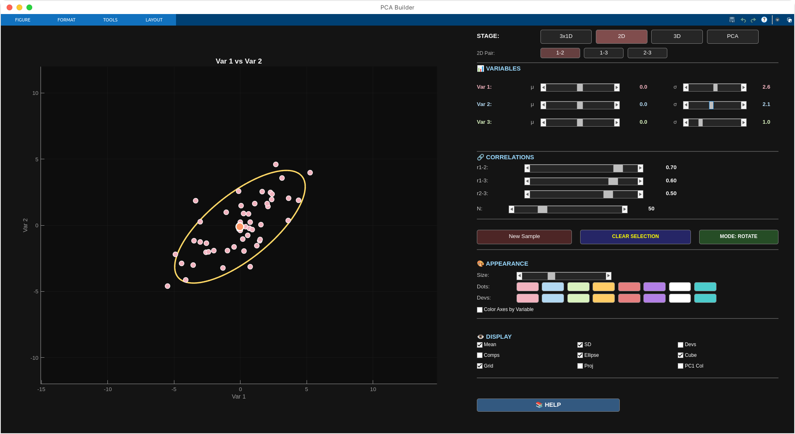</td>
  </tr>
  <tr>
    <td>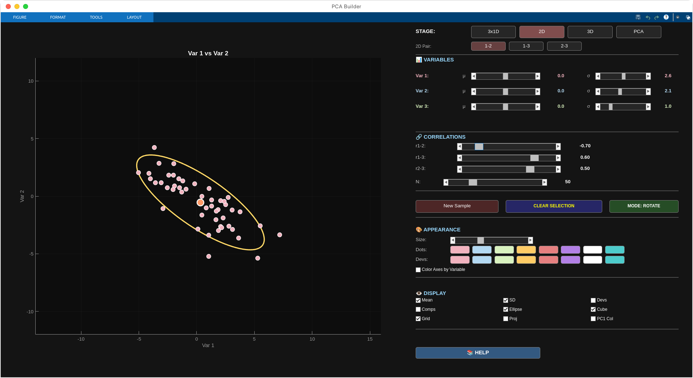</td>
    <td>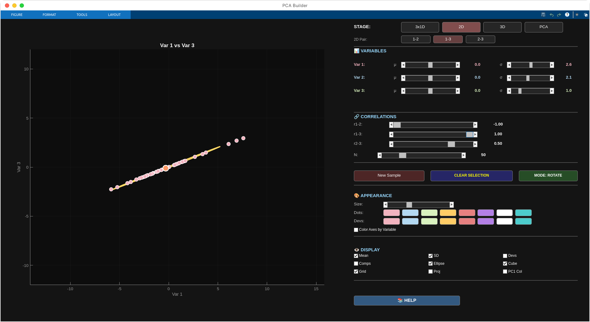</td>
  </tr>
  <tr>
    <td>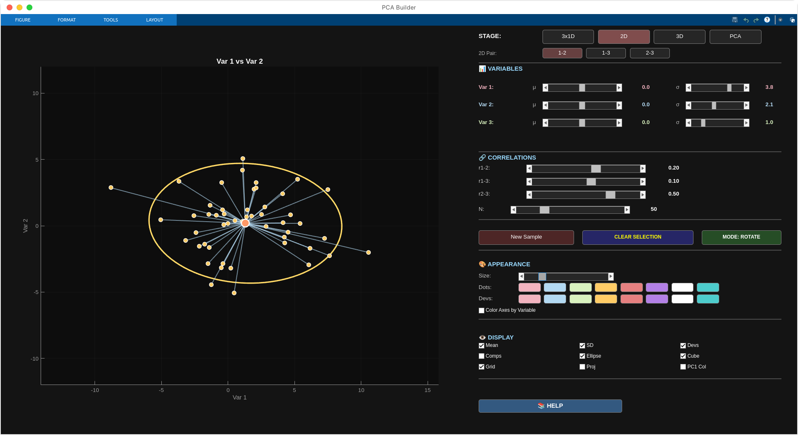</td>
    <td>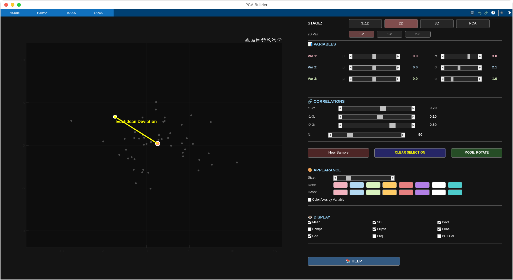</td>
  </tr>
  <tr>
    <td>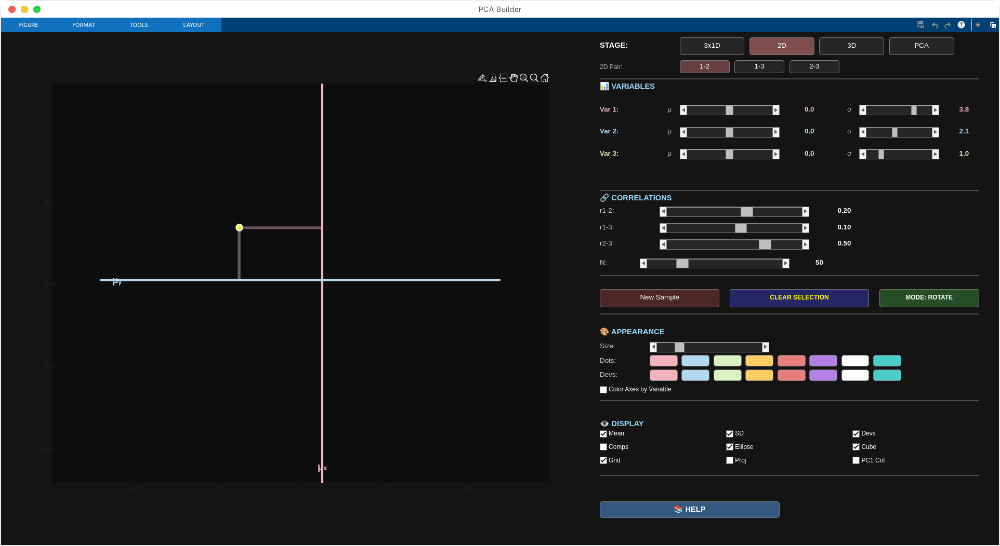</td>
    <td>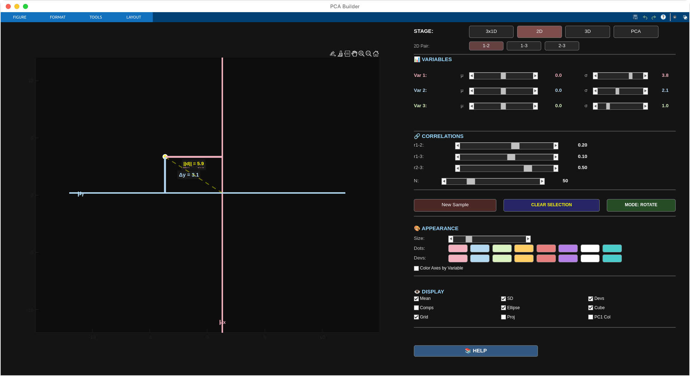</td>
  </tr>
  <tr>
    <td>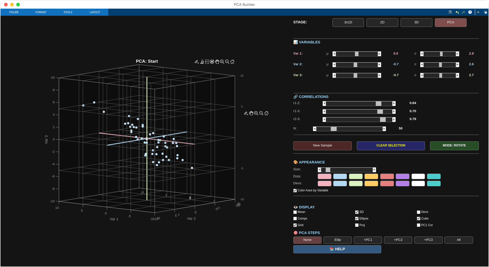</td>
    <td>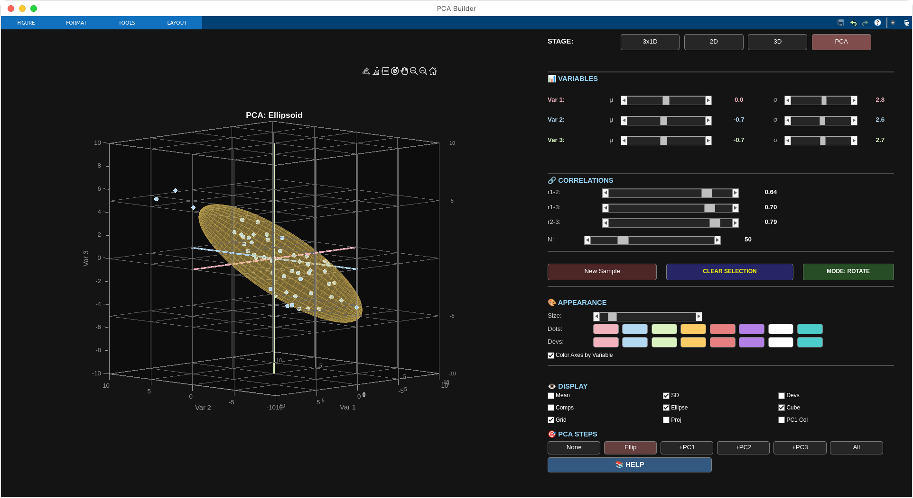</td>
  </tr>
  <tr>
    <td>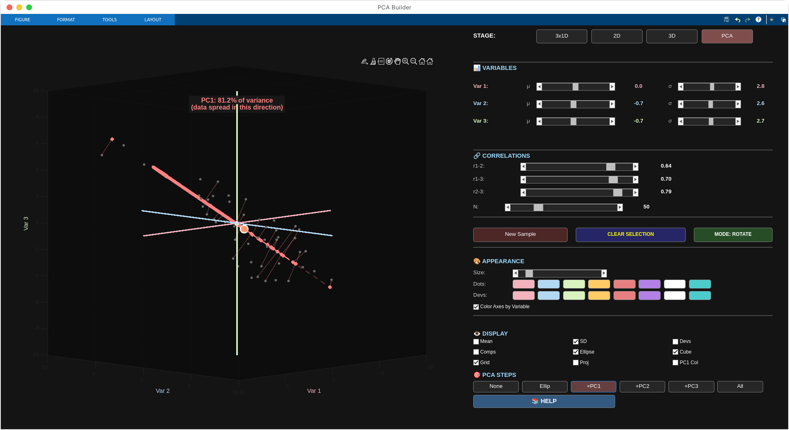</td>
    <td>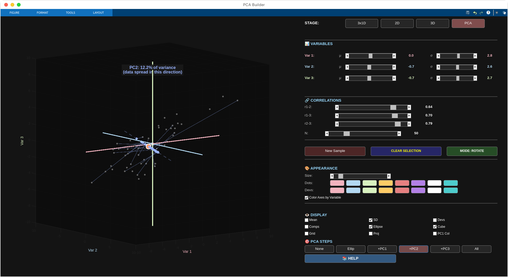</td>
  </tr>
  <tr>
    <td>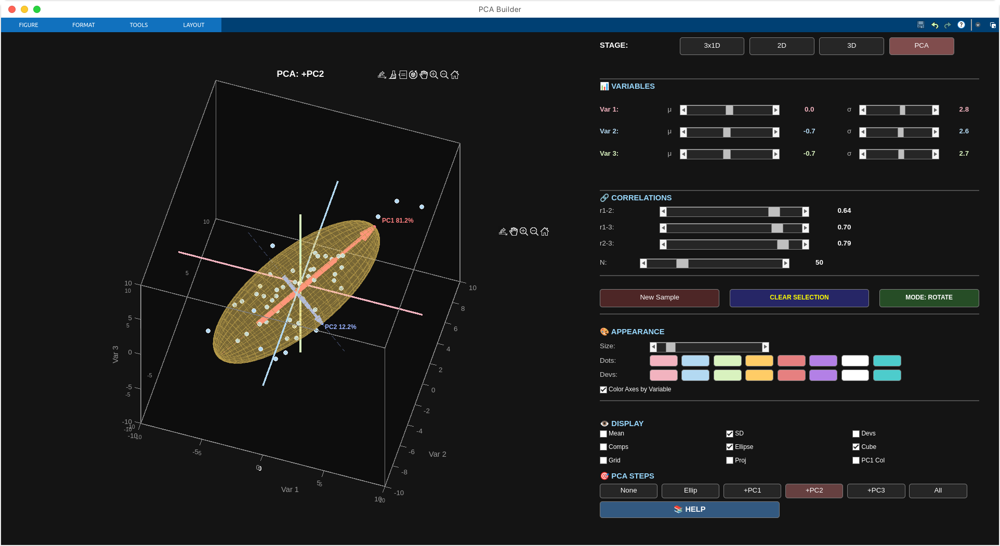</td>
    <td>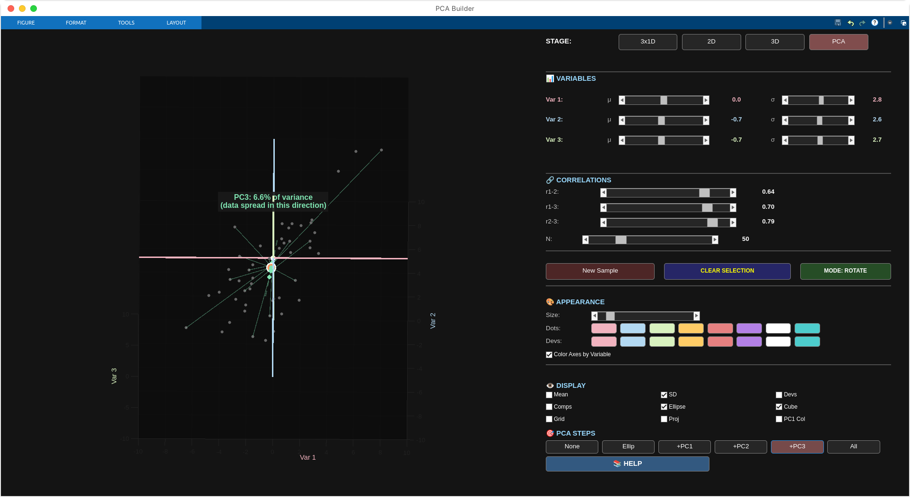</td>
  </tr>
  <tr>
    <td>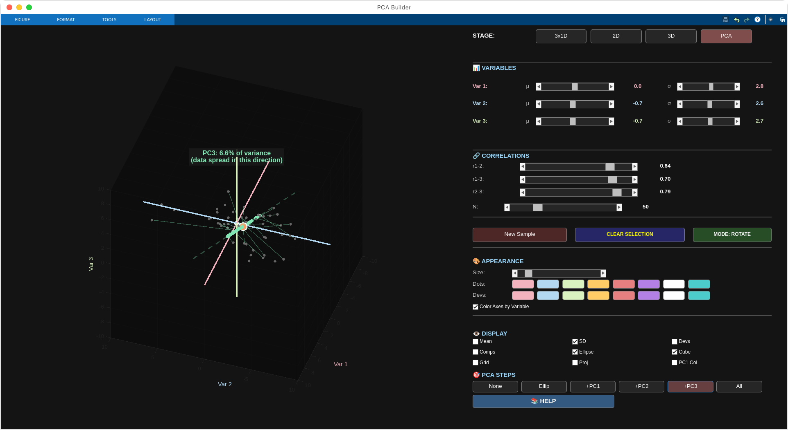</td>
    <td>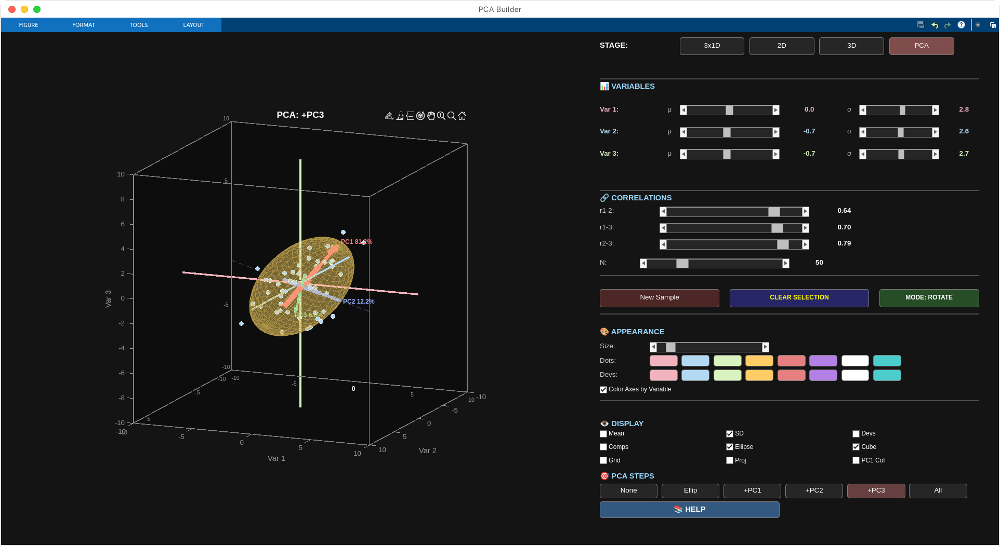</td>
  </tr>
</table>

</details>

---

## Contributing

Bug reports, feature requests, and improvements welcome. Open an issue or submit a pull request.

---

## License

MIT License - free to use and modify. If you improve it, consider contributing back.

---

## Links

- **GitHub Repository:** https://github.com/sachabechara/pca-visualization-tool
- **MATLAB File Exchange:** https://uk.mathworks.com/matlabcentral/fileexchange/182686
- **Author:** [Sacha Bechara](https://github.com/sachabechara)

Built to make PCA more accessible and visually intuitive.
